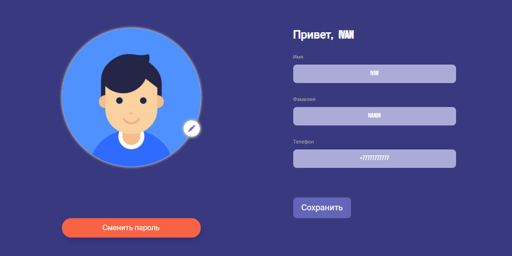
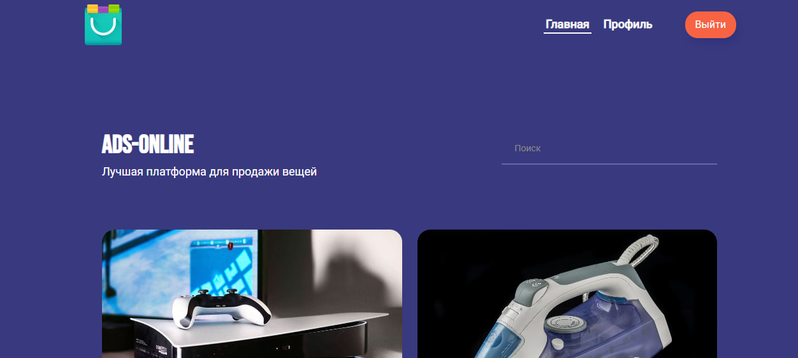

[//]: # (Заголовки)

<h1>
<i> ДИПЛОМНАЯ РАБОТА </i>
</h1>

<h2>
<i> Создание BACKEND части приложения для перепродажи вещей </i>
</h2>

   

[//]: # (Изображения)

   

[//]: # (Тело)

 

[//]: # (Описание)

  

<i> Описание приложения </i>

<ul>

<li>

<i> Приложение предназначено для опубликования авторизованными пользователями объявлений для последующей их перепродажи </i>

</li>

</ul>

 

[//]: # (Функионал)

  

<i> Функционал приложения </i>

<ul>

[//]: # (Регистрация)
<li>
<i> Регистрация </i>
</li>

[//]: # (Авторизация)
<li>
<i> Авторизация </i>
</li>

[//]: # (Пользователи)
<li>

  

<i> Пользователи </i>

<ul>

<li>
<i> Получение информации об авторизованном пользователе </i>
</li>

<li>
<i> Обновление пароля </i>
</li>

<li>
<i> Обновление информации об авторизованном пользователе </i>
</li>

<li>
<i> Обновление аватара авторизованного пользователя </i>
</li>

</ul>

</li>

[//]: # (Объявления)
<li>

  

<i> Объявления </i>

<ul>

<li>
<i> Получение всех объявлений </i>
</li>

<li>
<i> Добавление объявления </i>
</li>

<li>
<i> Получение информации об объявлении </i>
</li>

<li>
<i> Удаление объявления </i>
</li>

<li>
<i> Обновление информации об объявлении </i>
</li>

<li>
<i> Получение объявлений авторизованного пользователя </i>
</li>

<li>
<i> Обновление картинки объявления </i>
</li>

</ul>

</li>

[//]: # (Комментарии)
<li>

  

<i> Комментарии </i>

<ul>

<li>
<i> Получение комментариев объявления </i>
</li>

<li>
<i> Добавление комментария к объявлению </i>
</li>

<li>
<i> Удаление комментария </i>
</li>

<li>
<i> Обновление комментария </i>
</li>

</ul>

</li>

</ul>

 

[//]: # (Стек)

  

<i> Стек технологий </i>

<ul>

<li>
<i> Java 11 </i>
</li>

<li>
<i> Spring 2.7.15 </i>
</li>

<li>
<i> Maven </i>
</li>

<li>
<i> Tomcat </i>
</li>

<li>
<i> Spring Boot </i>
</li>

<li>
<i> Spring Web </i>
</li>

<li>
<i> Spring Security </i>
</li>

<li>
<i> Spring Validation </i>
</li>

<li>
<i> Spring AOP </i>
</li>

<li>
<i> Spring Test </i>
</li>

<li>
<i> Hibernate (JPA) </i>
</li>

<li>
<i> PostgreSQL </i>
</li>

<li>
<i> Lombok </i>
</li>

<li>
<i> Liquibase </i>
</li>

<li>
<i> Swagger UI </i>
</li>

<li>
<i> H2 </i>
</li>

<li>
<i> JUnit </i>
</li>

<li>
<i> Mockito </i>
</li>

</ul>

 

[//]: # (Запуск)

  

<i> Как запустить приложение </i>

<ol>

<li>
<i> Скачать <a href="https://github.com/IVANPOTEMKIN/Graduate-Work/tree/master"> репозиторий </a> и открыть проект в IntelliJ IDEA </i>
</li>

<li>
<i> Подключить к проекту БД </i>
</li>

<li>
<i> Запустить frontend Docker с помощью команды: </i>

<blockquote> docker run -p 3000:3000 --rm ghcr.io/dmitry-bizin/front-react-avito:v1.21 </blockquote>

</li>

<li>
<i> Запустить проект </i>
</li>

<li>
<i> Перейти по <a href="http://localhost:3000"> адресу </a> </i>
</li>

</ol>

 

[//]: # (Автор)

  

<i> Автор проекта </i>

<ul>

<li>

[<i> Иван Потемкин </i>](https://github.com/IVANPOTEMKIN)

</li>

</ul>

